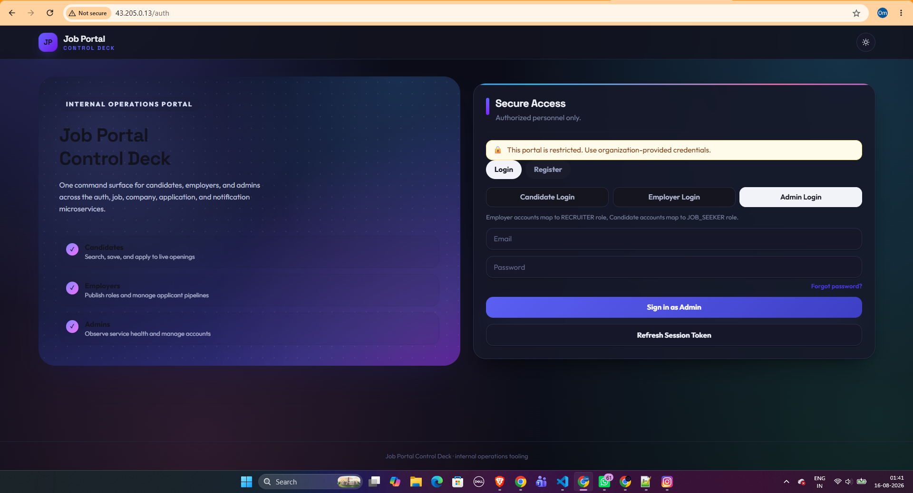
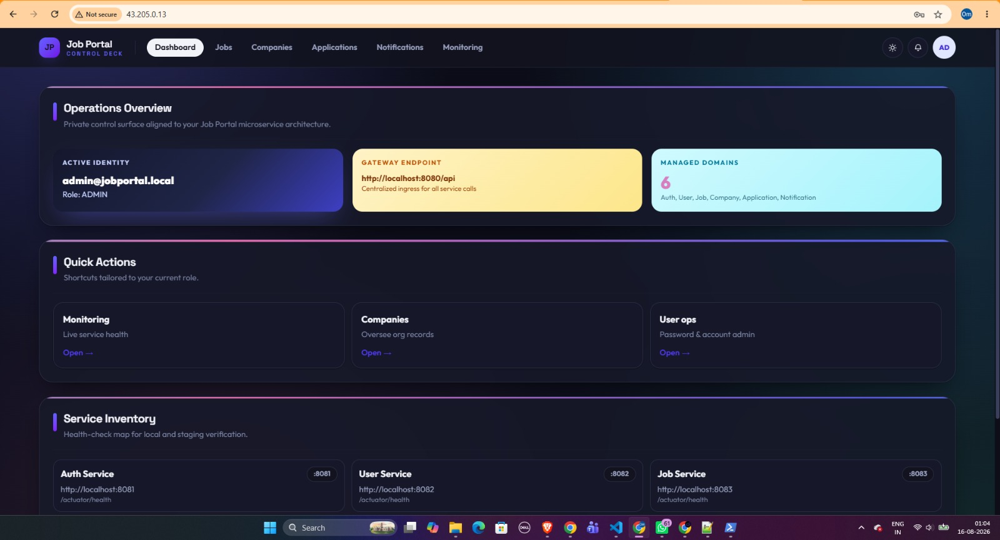
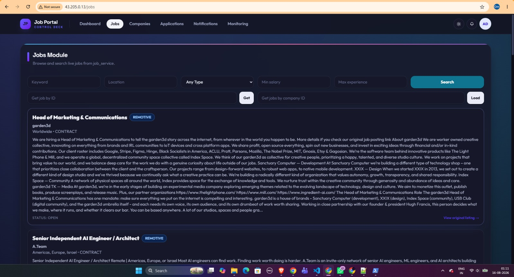
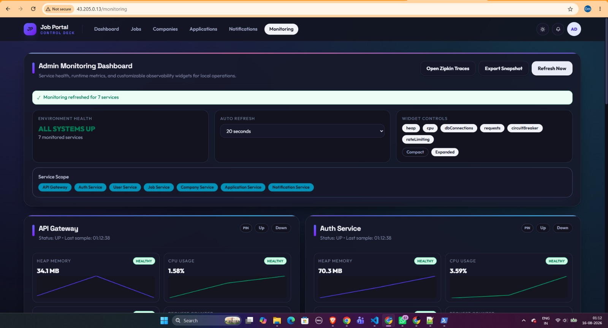

# Job Portal Platform

Production-style job portal platform with microservices backend and role-based frontend, built for hiring workflows across candidates, recruiters, and admins.

[](https://github.com/OmNaphade/job-portal/actions/workflows/ci.yml)
[](https://github.com/OmNaphade/job-portal)
[](https://www.oracle.com/java/)

## Latest Project Details

- Services: 9 microservices (auth, user, job, company, application, notification, api_gateway, config_server, service_registry)
- Frontend: React + Vite + Tailwind (Node 22), with light/dark themes, a live admin monitoring dashboard
  at `/monitoring`, a password-reset flow, a notification center with an unread badge, paginated job
  search, and confirmation dialogs guarding every destructive action
- Backend: Java 21 (Spring Boot 3.5, Spring Cloud), PostgreSQL per service, Kafka for event-driven notifications
- Resilience & Security: JWT + role-based `@PreAuthorize` RBAC, Resilience4j circuit breakers (auth → user), and a gateway-level per-client-IP rate limiter (stricter on `/api/auth/login`/`register`)
- Candidate features: saved/bookmarked jobs (`job_service`), resume upload on applications and profile avatar upload (local disk storage, volume-mounted in Docker) — see `API_DOCS.md` for endpoints
- External job import: `job_service` pulls listings from 10 external job boards on a 6-hour scheduler (Adzuna, Findwork, JobDataLake need a free API key; Himalayas, Arbeitnow, AI Dev Jobs, AI Jobs Co, Freehire, Remotive, and Jobicy work with no key at all), each behind its own Resilience4j circuit breaker — see `job_service/src/main/resources/application.properties`
- Caching: Redis-backed `@Cacheable` query caching on public read endpoints (`job_service`, `company_service`, `user_service`, 2–15 min TTLs depending on how often the data changes, evicted on writes) plus gateway-level HTTP caching (`Cache-Control` + weak `ETag`/`304` via `api_gateway`'s `CacheControlFilter`/`ScopedEtagFilter`) on the same public GET routes
- Observability: Prometheus metrics + Zipkin distributed tracing on every service, Grafana dashboards in `operations/grafana/`, k6 load tests in `performance/k6/`
- CI: GitHub Actions (build, test, integration smoke, Docker image build) — all 7 HTTP-facing services (including `api_gateway`) run their test suites in CI, not just build
- Code Coverage: frontend (Vitest) + backend (JaCoCo, wired via the root `pom.xml` for every module) reported to Codecov — `job_service`, `application_service`, `auth_service`, `user_service`, `company_service`, and `notification_service` all have real unit tests over their service layers; `api_gateway` covers CORS/rate-limiting; `config_server` and `service_registry` still have only the Spring Boot stub test
- Deployment: three documented paths. SSH-based CI scripts (`deploy-uat.sh`/`deploy-production.sh`) are present but **inactive** (templates — see `DEPLOYMENT_SCRIPTS.md`). `OCI_DEPLOYMENT_GUIDE.md` is a full from-zero walkthrough for deploying the stack across three Oracle Cloud Always Free VMs, using a split `docker-compose.core.yml` (backend, private subnet) + `docker-compose.edge.yml` (frontend, public subnet) topology instead of the single all-in-one `docker-compose.yml` used for local dev. `AWS_DEPLOYMENT_GUIDE.md` is the single-instance alternative — one right-sized EC2 instance running the unmodified `docker-compose.yml`, with real (not free-tier) pricing, since AWS has no free tier generous enough to fit this stack.
- Full API reference and architecture notes: see [`API_DOCS.md`](./API_DOCS.md); local run-from-source walkthrough: see [`STARTUP.md`](./STARTUP.md); cloud deployment walkthroughs: see [`OCI_DEPLOYMENT_GUIDE.md`](./OCI_DEPLOYMENT_GUIDE.md) (free, 3-VM split) and [`AWS_DEPLOYMENT_GUIDE.md`](./AWS_DEPLOYMENT_GUIDE.md) (paid, single instance)

## Table of Contents

- [About](#about)
- [Latest Project Details](#latest-project-details)
- [Screenshots](#screenshots)
- [Built With](#built-with)
- [Getting Started](#getting-started)
- [Usage](#usage)
- [Observability & Admin Tools](#observability--admin-tools)
- [Project Structure](#project-structure)
- [Testing](#testing)
- [Deployment](#deployment)
- [Contributing](#contributing)
- [License](#license)

## About

This project provides a complete hiring lifecycle system: authentication, profiles, jobs, companies, applications, and notifications behind an API Gateway. It is designed for teams that want a modular microservices backend with a modern React frontend, Docker-first local setup, and production-grade observability (metrics, tracing, dashboards) baked in rather than bolted on later.

## Screenshots

| | |
|---|---|
|  |  |
|  |  |

## Built With

- Java 21, Spring Boot 3.5, Spring Cloud (Gateway, Eureka, Config Server)
- Resilience4j (circuit breakers, rate limiting), Kafka (event-driven notifications)
- React 19 + Vite + Tailwind CSS
- PostgreSQL, Redis (query caching), Prometheus, Zipkin, Grafana, k6
- Docker Compose, GitHub Actions

## Getting Started

### Prerequisites

- Java 21+
- Node.js 22+
- Docker + Docker Compose

### Installation

```bash
git clone https://github.com/OmNaphade/job-portal.git
cd job-portal
```

Frontend:

```bash
cd frontend
npm install
```

### Configuration

```bash
cp .env.example .env
cp frontend/.env.example frontend/.env
```

Root `.env` covers backend secrets (`JWT_SECRET`, `CORS_ALLOWED_ORIGINS`, `MAIL_USERNAME`/`MAIL_PASSWORD`).
Frontend `.env` covers `VITE_API_BASE_URL`, `VITE_ALLOW_SELF_REGISTER`, and `VITE_ZIPKIN_URL` (used by the
admin dashboard's "Open Zipkin Traces" link). See [`STARTUP.md`](./STARTUP.md) for the full list of
backend environment variables and running services from source (without Docker).

## Usage

Start full local stack (Postgres, Redis, Kafka, Zipkin, all 9 services):

```bash
docker compose up -d --build
```

A seeded admin account is available by default in Compose (`admin@jobportal.local` / `Pass123!`,
controlled via `ADMIN_SEED_*` env vars — see `API_DOCS.md`).

Frontend dev:

```bash
cd frontend
npm run dev
```

Run validation scripts (PowerShell on Windows or use WSL):

```powershell
./scripts/synthetic-checks.ps1   # route/guard smoke checks against the gateway
./scripts/journey-checks.ps1     # candidate/employer/admin end-to-end flows
```

Additional local-ops scripts live in `scripts/` — environment validation, one-command bootstrap, demo
data seeding, DB backup/restore, failure-injection drills, and a lightweight logs/health dashboard. See
the "Local Operations Scripts" section of [`STARTUP.md`](./STARTUP.md) for the full list.

## Observability & Admin Tools

- **Admin monitoring dashboard** — `/monitoring` in the frontend (ADMIN role required). Live per-service
  health, heap/CPU, DB connections, request counts, circuit-breaker state, and gateway rate-limit
  rejections, with sparkline history, pin/reorder, and JSON export.
- **Zipkin** — distributed traces across all 7 HTTP-facing services, at `http://localhost:9411/zipkin/`
  (also linked directly from the admin dashboard).
- **Prometheus** — every service exposes `/actuator/prometheus`; see `API_DOCS.md` for the scrape config.
- **Grafana** — pre-built dashboards in `operations/grafana/dashboards/` (service overview, Kafka/DB
  overview) — import into any Grafana instance pointed at the Prometheus scrape config.
- **k6 load tests** — `performance/k6/` (login → search → apply journey, notification read path). Run with
  `k6 run performance/k6/login-search-apply.js` against a running stack.

## Project Structure

- `frontend/` - React app (incl. the admin monitoring dashboard)
- `auth_service/`, `user_service/`, `job_service/`, `company_service/`, `application_service/`,
  `notification_service/` - Java microservices
- `api_gateway/`, `service_registry/`, `config_server/` - infra services
- `pom.xml` - Maven parent (shared dependency/plugin management, incl. JaCoCo for every module)
- `operations/grafana/` - Grafana dashboard JSON
- `performance/k6/` - k6 load test scripts
- `scripts/` - local-ops PowerShell scripts (validation, seeding, backup/restore, failure drills,
  deployment templates) — see `STARTUP.md` for the full catalog
- `docker-compose.yml` - full local stack (Postgres, Redis, Kafka, Zipkin, all 9 services)
- `docker-compose.core.yml` / `docker-compose.edge.yml` - the same backend/frontend split for a multi-VM
  cloud deployment (backend services + frontend on separate hosts) — see `OCI_DEPLOYMENT_GUIDE.md`
- `.github/workflows/ci.yml` - CI pipeline
- `API_DOCS.md` - full API reference and architecture notes
- `STARTUP.md` - run-from-source guide (no Docker)
- `ENVIRONMENTS.md` - dev/uat/prod environment setup: Spring profiles, `env/*.env` files, branch flow
- `OCI_DEPLOYMENT_GUIDE.md` - from-zero walkthrough for deploying to Oracle Cloud Always Free tier
- `AWS_DEPLOYMENT_GUIDE.md` - from-zero walkthrough for deploying to a single AWS EC2 instance (paid, no AWS free tier is large enough for this stack)

## Testing

- Backend: `./mvnw clean verify` per-service (JaCoCo coverage report generated for every module).
  `job_service` and `application_service` have real unit tests over their service layer (pagination,
  search, the `ApplicationStatus` state machine, Kafka publish behavior, saved-jobs, resume upload);
  `auth_service` has an integration test over register/login; `api_gateway` has tests for CORS, the
  rate limiter, and the JWT auth filter's public-path allowlist (including the avatar exception);
  `user_service` (profile/skills/avatar upload), `company_service` (companies/recruiters),
  and `notification_service` (notifications, read/unread state) now have real unit tests over their
  service layers as well. `config_server` and `service_registry` still have only the Spring Boot stub
  test — they're thin infra wrappers with no custom logic to cover.
- Frontend: `npm run test` (Vitest + React Testing Library — component tests cover the theme toggle,
  account dropdown, and the reusable confirmation-dialog system) and `npm run test:e2e` (Playwright)
- CI runs the full backend test matrix (all 7 HTTP-facing services) plus an integration smoke stage that
  spins up the full Docker Compose stack and runs the synthetic + journey scripts above.

## Deployment

Three paths are documented:

- **CI-driven SSH deploy (template, inactive)** — `scripts/deploy-uat.sh` and `scripts/deploy-production.sh`,
  wired into `.github/workflows/ci.yml` as `deploy-uat`/`deploy-prod` jobs. Detailed instructions
  are in `DEPLOYMENT_SCRIPTS.md`; environment/profile setup is in `ENVIRONMENTS.md`.

  > Note: the real SSH + Docker logic in both scripts is currently commented out — they print a placeholder
  > and exit successfully so the pipeline stays green. To enable real deployments:
  > 1. Provision servers and ensure Docker is installed
  > 2. Add secrets in GitHub repo settings: `UAT_DEPLOY_KEY`, `UAT_HOST`, `UAT_USER`, `PROD_DEPLOY_KEY`, `PROD_HOST`, `PROD_USER`
  > 3. Uncomment the `REAL DEPLOYMENT` block in the relevant script and adjust paths

- **Manual Oracle Cloud deployment (documented, self-hosted, free)** — [`OCI_DEPLOYMENT_GUIDE.md`](./OCI_DEPLOYMENT_GUIDE.md)
  walks through deploying the full stack across three Oracle Cloud Always Free VMs: backend services
  (`docker-compose.core.yml`) on a private-subnet VM, the frontend (`docker-compose.edge.yml`) on a
  public-subnet VM acting as reverse proxy, with networking, security lists, and troubleshooting covered
  end to end.

- **Manual AWS deployment (documented, self-hosted, paid)** — [`AWS_DEPLOYMENT_GUIDE.md`](./AWS_DEPLOYMENT_GUIDE.md)
  walks through deploying the unmodified `docker-compose.yml` (all 15 containers) to a single right-sized
  EC2 instance, since AWS's free tier (1 GB RAM) can't fit this stack. Covers instance sizing, security
  groups, Elastic IP setup and its real (non-free) cost, Windows-specific SSH setup, CORS configuration for
  the deployed origin, an AWS Budgets auto-stop safety net, and stop/resume procedures.

## Contributing

Contributions welcome. Please open issues or PRs.

## License

MIT
